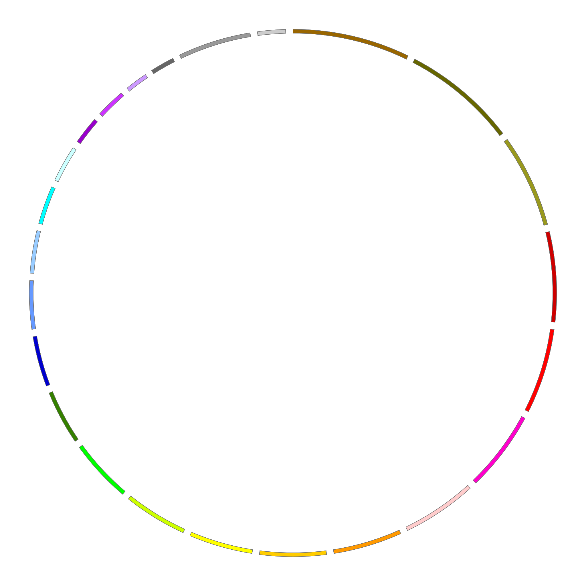
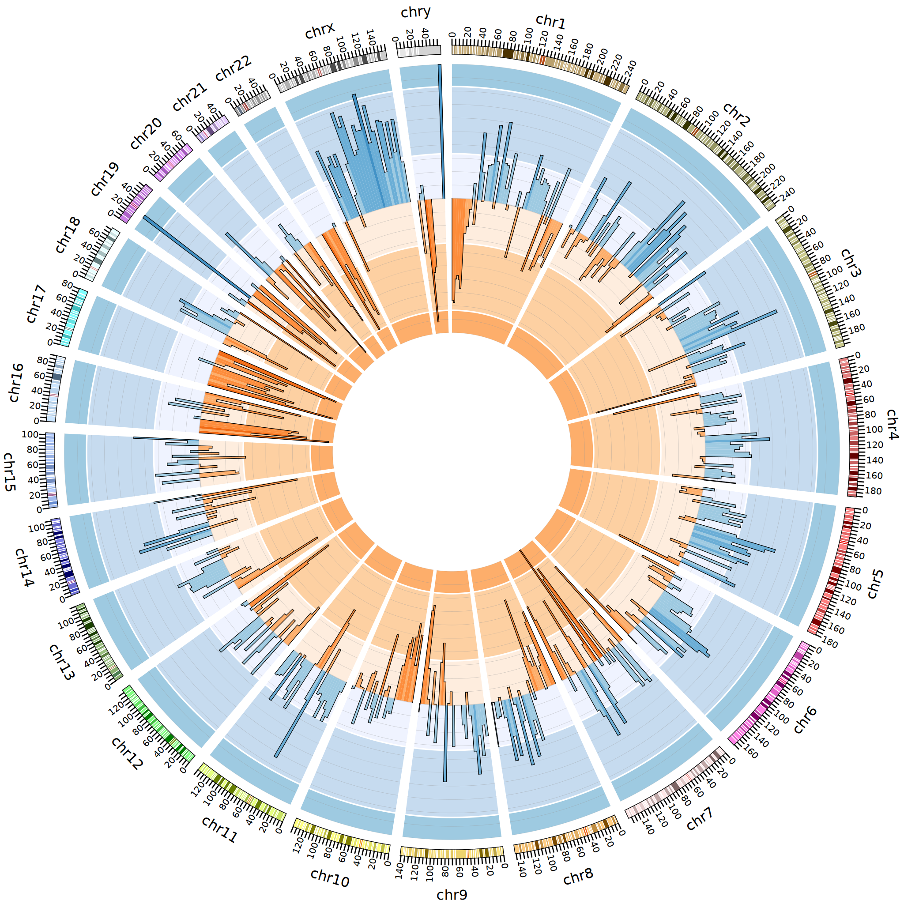
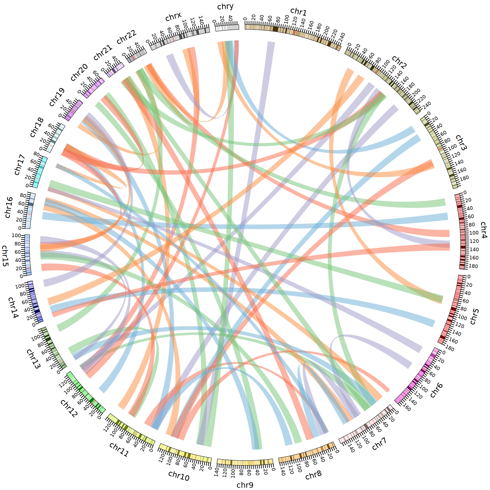

### Example for circos 

Make a directroy called circos in your home directory 

```bash
cd /projects/my-lab/08-circos
```

Verify nothing is in the directory

```bash
ls -lF
```

Make a circos SIF file by pulling the docker image circos.

```bash
singularity pull docker://alexcoppe/circos
```


Download the circos tutorial. 
```bash
wget http://circos.ca/distribution/circos-tutorials-current.tgz
```


Untar and gzip the downloaded file. 

```bash
tar xzvf circos-tutorials-current.tgz
```


```bash
ls -1F
```


```output
circos_latest.sif*
circos-tutorials-0.67/
circos-tutorials-current.tgz

```

Run tutorial 1/1

```bash
singularity exec -B $PWD circos_latest.sif /opt/circos/bin/circos -conf circos-tutorials-0.67/tutorials/1/1/circos.conf
```


The base image of the human chromosomes was created

{alt="circos example 1 dot 1"}


Run tutorial 8/6 histograms 

```bash
singularity exec -B $PWD circos_latest.sif /opt/circos/bin/circos -conf circos-tutorials-0.67/tutorials/8/6/circos.conf
```


An image with histograms

{alt="circos example 8 dot 6"}

Run tutorial 8/11 links

```bash
singularity exec -B $PWD circos_latest.sif /opt/circos/bin/circos -conf circos-tutorials-0.67/tutorials/8/11/circos.conf
```


An image with links

{alt="circos example 8 dot 11"}


